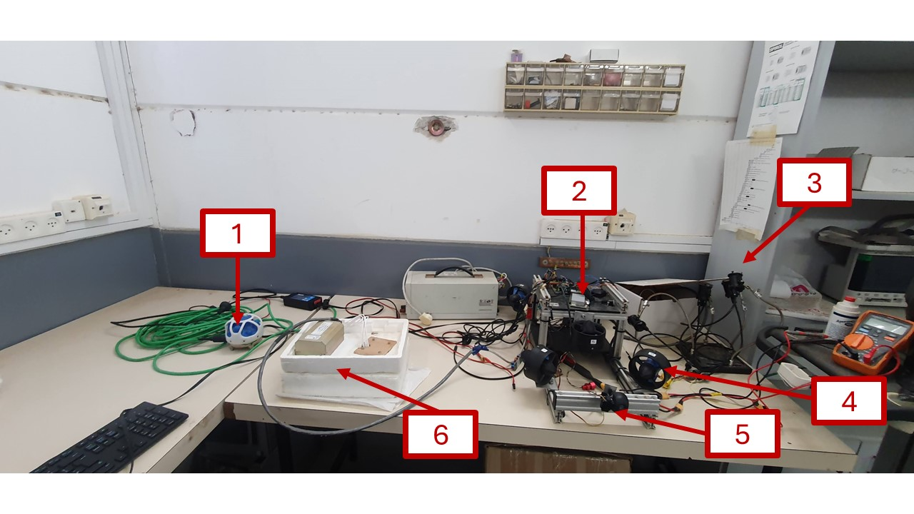
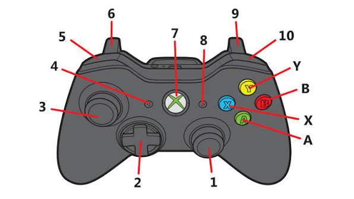
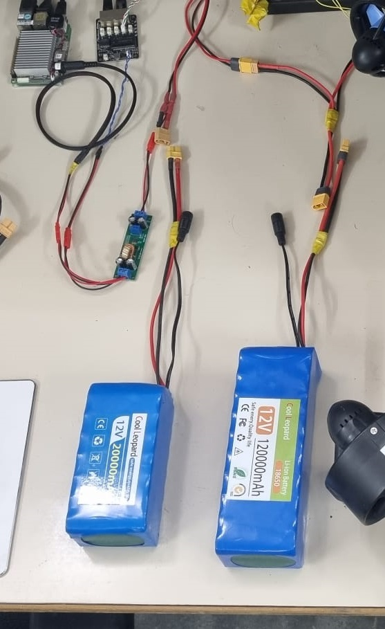

# HAUV — Hybrid Autonomous Underwater Vehicle

A compact underwater robot you drive from a laptop with a game controller — or
point at a spot on the map and let it swim there by itself.

It runs **ROS 2 Foxy** across two computers, talks to **QGroundControl** over
either an Ethernet tether or an **acoustic (USBL) link**, and looks after itself
with a leak failsafe that surfaces the vehicle without any help from the operator.



| # | Part | What it does |
|---|------|--------------|
| 1 | **Subsonus (USBL modem)** | Acoustic link to the surface — control with no cable |
| 2 | **Electronics tray** | The two computers and their boards |
| 3 | **Lights** | Two switchable sets |
| 4 | **Thrusters** | 6 × Blue Robotics T200 |
| 5 | **Camera** | Live video to the operator screen |
| 6 | **DVL** | Speed over the sea floor |

---

## Highlights

- **Two control links** — Ethernet tether (full telemetry + video) or acoustic
  USBL (compact telemetry, no cable, no video).
- **Auto-GOTO / Guided mode** — click a point in QGC, the vehicle turns, swims
  there, **holds depth** on the way and **station-keeps** on arrival.
- **Leak → auto-surface failsafe** — runs on the vehicle itself, so it still
  works with the link cut.
- **Link-loss failsafe** — thrusters stop if the operator link goes quiet.
- **Attitude safety envelope** — scales back thrust when pitch/roll get extreme.
- **One-command operation** — `./hauv.sh` starts, checks and inspects everything.

---

## Architecture

Work is split across two computers. Knowing which does what makes debugging much
faster.

| Computer | Role |
|----------|------|
| **UP Board** (Ubuntu 20.04, ROS 2 Foxy) | The brain — guidance, sensor fusion, navigation, QGC telemetry |
| **ESP32** (micro-ROS over serial) | The muscles — motor PWM, lights, and the depth / IMU / leak sensors |

```
ESP32 sensors ──micro-ROS──> /esp32/bno055_data, /esp32/bar100_data, /esp32/leak
DVL (Ethernet) ────────────> /dvl/velocity_data
GPS ───────────────────────> /gps/fix
Joystick / QGC ────────────> /joy  |  /joy_acoustic
                                      │
                                guidance_node
                                      │
                /motor_data, /lights_servo_data ──> ESP32 PWM outputs
                                      │
                    mavlink_bridge_node ──> QGC   (Ethernet, UDP 14550)
                    acoustic_bridge_node ─> QGC   (acoustic link)
```

### Inside the electronics tray


| # | Board |
|---|-------|
| 1 | **UP Board** — the main computer (large heatsink) |
| 2 | **Indicator light** — solid = ESP32 talking to ROS 2, off = link down |
| 3 | **ESP32** — real-time motor and sensor controller |
| 4 | **Thruster** |
| 5 | **I²C connector** — to the temperature sensor |
| 6 | **GPS antenna** |

---

## Quick start

Everything is driven by one script on the UP Board:

```bash
./hauv.sh start              # start the full stack (Ethernet / tethered)
./hauv.sh start --acoustic   # start in acoustic mode (no cable)
./hauv.sh check              # sample every sensor, report OK / LOW / FAIL
./hauv.sh status             # what's running
./hauv.sh topics             # live topics and their short names
./hauv.sh echo DEPTH         # stream one topic (no ros2 CLI needed)
./hauv.sh view guidance      # attach to a node's log  (Ctrl-A D to detach)
./hauv.sh stop
```

> `check` and `echo` use a direct rclpy subscriber rather than `ros2 topic echo`,
> because DDS CLI discovery is unreliable on this box — topics can look empty
> while they are actually publishing.

The DVL reports **FAIL** out of the water. That's expected — it needs water and
a bottom to range against.

---

## Connecting QGroundControl

### Over Ethernet (normal)

Set your laptop to `192.168.168.100`, then add a UDP link to
`192.168.168.101:14550`:


> Turn **AutoConnect → UDP** *off* in QGC's General settings, or it may grab the
> wrong endpoint and the vehicle will look dead.

### Over acoustic (untethered)

Both Subsonus units must be **in the water**. Start the vehicle with
`./hauv.sh start --acoustic`, then run **one** instance of the PC-side bridge and
point QGC at `127.0.0.1:14551`:

```bash
python tools/acoustic_qgc_bridge.py
```


### Flying


Telemetry, compass, video and warning banners all appear here. Alerts worth
knowing:

| Message | Meaning |
|---------|---------|
| `LEAK! Auto-surfacing` | Water inside. The vehicle is already ascending by itself — recover it. |
| `ACOUSTIC LINK LOST` | Modems can't hear each other. Check both are powered and submerged. |
| `FAIL: <sensor>` | That sensor stopped reporting. |

---

## Controls



| # | Control | Action |
|---|---------|--------|
| 3 | Left stick | Forward / back, and strafe sideways |
| 1 | Right stick | Turn (yaw), and ascend / descend |
| A | A button | Toggle one set of lights |
| B | B button | Toggle the other set of lights |
| 5 | LB | Camera tilt up |
| 10 | RB | Camera tilt down (also switches mode) |

Any stick movement cancels Guided mode and returns control to you.

### Flight modes

| Mode | Behaviour |
|------|-----------|
| **Manual** | You control everything. |
| **Stabilize** | Holds attitude level while you drive. |
| **Guided** | *Go to location* — drives to a clicked point, holds depth, then station-keeps until you take over. |

---

## Power



Two 12 V lithium packs — one for the computers, one for the thrusters — joined
with XT-style plugs. The small green board steps 12 V down for the electronics.

> **Never** join red to black. Always power the vehicle off before connecting or
> carrying it, and never charge a hot or swollen pack unattended.

---

## Devices and addresses

| Device | Address / Port |
|--------|----------------|
| UP Board | `192.168.168.101` |
| DVL | `192.168.168.102` (cmd 1033, binary 1034, string 1037) |
| Operator PC | `192.168.168.100` |
| Subsonus (surface) | `168.254.1.80` |
| QGC MAVLink | UDP `14550` (Ethernet) / `14551` (acoustic bridge) |
| ESP32 serial | the `ttyUSB*` with `ID_VENDOR=Silicon_Labs` — auto-detected |
| BNO055 IMU | I²C `0x28` |

Static IPs on `192.168.168.x/24`. Keep `ROS_DOMAIN_ID` identical on every
machine (`export ROS_DOMAIN_ID=0`).


---

## Packages

| Package | Contents |
|---------|----------|
| `autopilot_pkg` | `guidance_node` (modes, PID, motor mixing, GOTO, leak failsafe), `dvl_node`, `subsonus_node`, `acoustic_bridge_node`, `health_monitor_node` |
| `mavlink_bridge_pkg` | ROS 2 ↔ QGC MAVLink over UDP |
| `camera_pkg` | USB camera → `/camera_image` |
| `gps_pkg` | u-blox GPS → `/gps/fix` |
| `my_launch_pkg` | Launch files |
| `esp_sketches/rov_esp_main` | ESP32 firmware (micro-ROS) |

### Key topics

| Topic | Type | Notes |
|-------|------|-------|
| `/esp32/bno055_data` | `geometry_msgs/Twist` | `linear.x/y/z` = yaw / pitch / roll |
| `/esp32/bar100_data` | `geometry_msgs/Vector3` | `x` = depth (m), `y` = pressure, `z` = temp |
| `/esp32/leak` | `std_msgs/Float64` | `0.0` dry, `1.0` leak |
| `/motor_data` | `geometry_msgs/Twist` | Motors 1–6 as PWM µs (1100–1900, neutral 1500) |
| `/lights_servo_data` | `geometry_msgs/Vector3` | light1, light2, camera servo angle |
| `/guidance/goto_target` | `sensor_msgs/NavSatFix` | Guided-mode destination |

> `Twist` is used two different ways: on `/motor_data` the fields are **motor
> PWM values**, on `/dvl/velocity_data` they are **velocities**. Check the topic
> before interpreting the fields.

---

## Building

```bash
colcon build                                  # whole workspace
colcon build --packages-select autopilot_pkg  # one package
colcon test --packages-select autopilot_pkg   # lint + style
```

### ESP32 firmware

```bash
arduino-cli compile --fqbn esp32:esp32:esp32da src/esp_sketches/rov_esp_main/rov_esp_main.ino
arduino-cli upload -p /dev/ttyUSB0 --fqbn esp32:esp32:esp32da src/esp_sketches/rov_esp_main/rov_esp_main.ino
```

After flashing, restart the micro-ROS agent **with a DTR reset** — otherwise the
subscriptions come up dead and the motors won't respond.

### Deploying Python changes

The running code lives in the **install** tree, not `src`:

```
install/<pkg>/lib/python3.8/site-packages/<pkg>/<file>.py
```

---

## Troubleshooting

| Symptom | Try |
|---------|-----|
| QGC won't connect | Check the cable, laptop IP `192.168.168.100`, `ping 192.168.168.101`, AutoConnect-UDP off |
| Vehicle visible but won't move | ESP32 ↔ ROS link down — check the green indicator, then `./hauv.sh restart` |
| No video | Video is Ethernet-only; it never runs over the acoustic link |
| DVL says FAIL | Normal out of water |
| `ACOUSTIC LINK LOST` | Both modems submerged and powered? Only **one** PC bridge running? |
| Sensors missing | `./hauv.sh check` to see which, then `./hauv.sh restart` |

```bash
ros2 topic list
ros2 topic hz /esp32/bno055_data
lsof | grep /dev/ttyUSB0        # who owns the serial port
sudo journalctl -u rov_nodes.service -f
```

---

## Acknowledgments

- **Prof. Hugo Guterman**, project advisor.
- **Ben-Gurion University**, Department of Electrical and Computer Engineering.

